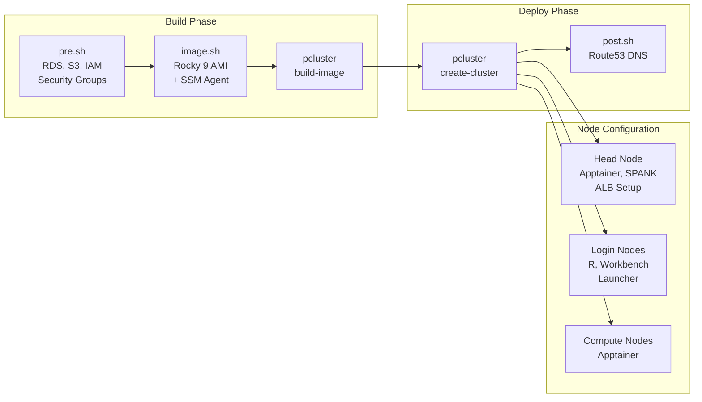

# AWS ParallelCluster with Posit Workbench Architecture

## Component Summary

| Component | Type | Purpose |
|------------------------------|------------------|-------------------------|
| Head Node | t3.xlarge | Slurm controller, ALB sync cron job |
| Login Nodes | 2x t3.xlarge | Posit Workbench UI, Slurm Launcher |
| Compute Queues | t3.xlarge, g4dn.xlarge | R/Python sessions via Apptainer |
| ALB | Internal, HTTPS | SSL termination for Workbench |
| NLB | Network | SSH access to login nodes |
| FSx Lustre | 1.2 TB | User home directories |
| EFS | Elastic | Workbench configs, scripts, containers |
| RDS PostgreSQL | db.t3.micro | Session state, audit logs |
| S3 | Bucket | Bootstrap scripts, config files |

## Deployment Pipeline

## Security Groups

| Name             | Ports       | Source       |
|------------------|-------------|--------------|
| pwb-alb-sg       | 443 (HTTPS) | 0.0.0.0/0    |
| pwb-login-access | 8787, 5559  | 10.13.0.0/16 |
| pwb-db-access    | 5432        | 10.13.0.0/16 |

## IAM Policies

| Policy Name | Purpose | Permissions |
|-------------|---------|-------------|
| aws-pc-pwb-s3-access-$USER | S3 bucket access for cluster nodes | s3:GetObject, s3:PutObject, s3:DeleteObject, s3:ListBucket |
| aws-pc-pwb-ec2-runinstances-$USER | EC2 instance creation | ec2:RunInstances |
| aws-pc-pwb-elb-$USER | ALB target sync from head node | elasticloadbalancing:DescribeTags, DescribeTargetGroups, DescribeLoadBalancers, DescribeTargetHealth, RegisterTargets; ec2:DescribeNetworkInterfaces, DescribeSubnets |
| AmazonSSMRoleForInstancesQuickSetup | SSM access for Rocky 9 base AMI | SSM managed instance core |

## DNS Records

| Record                             | Target      |
|------------------------------------|-------------|
| workbench.pcluster.soleng.posit.it | ALB (HTTPS) |
| hpclogin.pcluster.soleng.posit.it  | NLB (SSH)   |

## Notes on the co-existence of the NLB and ALB 

The ALB is created by the `install-head-node.sh` script. Accordingly listener and target group is created and the two login nodes added. In order to keep things in sync between the NLB and ALB, there is a `systemd` timer job running every 5 minutes on the head node that keeos the targets in the ALB's target group in sync with the one from the NLB. This is necessary as ParallelCluster will automatically reprovision new login nodes in case a node crashes. 

## Notes on the Workbench Integration

This workbench setup exclusively relies on Apptainer/Singularity integration. 

The Workbench Integration happens in various scripts 

As part of the [install-head-node.sh](scripts/install-head-node.sh) script we 

* install Apptainer
* build a sample image into `/opt/rstudio/container` 
* install the SPANK plugin for Singularity 
* deploy the ALB and its dependencies
* create the systemd timer job
* deploy a sample set of config files for Posit Workbench into `/opt/rstudio/etc/rstudio` that later on is used for deployment on the login nodes 

[install-login-node.sh](scripts/install-login-node.sh) installs Workbench, deploys the configuration files from  `/opt/rstudio/etc/rstudio` and ends with restarting `rstudio-server` and `rstudio-launcher` to pick up the new config.

[install-compute-node.sh](scripts/install-compute-node.sh) installs Apptainer only. Given the fact we are using container files, the compute node do not need any installation of any additional software. 

All of the three scripts are referenced/called from the ParallelCluster config YAML file. 
